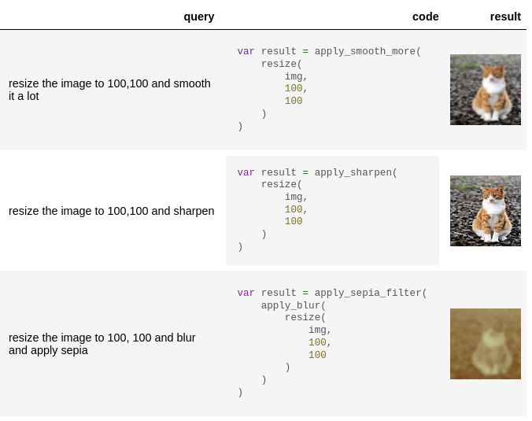

[](https://github.com/langchain-ai/kork/actions/workflows/test.yml)

# Kork 

`Kork` is an *experimental* [Langchain chain](https://python.langchain.com/docs/modules/chains) that helps build natural language APIs powered by LLMs.

## Features

1. Assemble a natural language API from a set of python functions.
2. Generate a prompt to help the LLM write a **correct** program.
3. Execute the program generated by the LLM **safely**.
4. Program generation takes a single LLM call, as opposed to agents that use a call per action taken.

## Show me! 😹 

[Image manipulation API using PIL](https://langchain-ai.github.io/kork/examples/image_manipulation.html)



## How

The chain takes a user query, translates it into a program, and executes it using the `Kork` interpreter.

The interpreter is used to run code written in the `Kork` programming language.

The language is limited by design to variable declarations, function invocations and arithmetic operations.

This limitation allows controlling the kind of programs the LLMs can generate, making the output of the LLM more predictable and safer to execute in a production setting. (An agent with access to "constrained" tools has similar benefits, but requires a call per action taken.)

`Kork` adds a few additional tricks (e.g., retriever interfaces for examples and foreign functions) to help guide the LLM to generate a **correct** program.

## What?

*No loops, no conditionals, no file access, no network access, no arbitrary code execution. WHAT?!*

The ability to invoke custom functions goes a long way in terms of the kinds of programs that can be written! (You can always add a `write_to_file` function!)


## Limitations

- `Kork` **cannot write arbitrary** code. If that's what you need, save yourself some time and use [docker](https://www.docker.com/) and a real programming language.
- The `Kork` chain is **not** an Agent, so it cannot inspect intermediate steps, instead it generates a pre-defined set of function calls that need to be executed. (But remember that function calls can involve calls to an agent!)
- The `Kork` language and interpreter are limited to *function invocation*, *variable declaration* and
  *basic arithmetic* (no function declaration, loops etc.)
- Only supporting `int`, `float`, `str`, `type(None)`, `bool` types. No support for `lists` or `object` types.
- Very limited type annotations.

## Quality

The short version: No benchmarks yet!

The long version: Quality of generated programs depends on many factors.

You can experiment with tweaking the prompt (e.g., explain the syntax of the language), changing the foreign function retriever (e.g., retrieve the most relevant foreign functions based on the user query), or providing examples in the form of (query, expected program).

The prompt, examples and syntax of the language can trip up the LLM to assume
it's programming in a specific language (e.g., typescript or python) and assume
that it can use language features that are not supported by `Kork` or to import
libraries that are not available.

## Safety

Nothing is bulletproof when humans are involved.

* Don't do silly things like exposing `eval` as a foreign function.
* If a foreign function allocates memory, the LLM could ask for more memory than is available crashing the process.
* Think carefully before using the output of an LLM. If the LLM behaves maliciously, is it safe to use an LLM in the given context? 

## Future Work

Let us know if you're interested in contributing or have ideas for improvements!

- Allow enabling/disabling language features
- Allow changing underlying language syntax
- Add support for objects
- Add other language features (e.g., loops) 
- Provide foreign function retriever implementations based on similarity to user query

## Compatibility

`Kork` is tested against python 3.8, 3.9, 3.10, 3.11.

## Installation 

```sh
pip install kork
```

## 🙏 Appreciation

* [Lark](https://github.com/lark-parser/lark) -- For making it easy to define a grammar and parse it!
* [Bob Nystrom](https://github.com/munificent) -- For writing [Crafting Interpreters](https://www.craftinginterpreters.com/)!

## © Contributing

If you have any ideas or feature requests, please open an issue and share!

See [CONTRIBUTING.md](https://github.com/langchain-ai/kork/blob/main/CONTRIBUTING.md) for more information.

## 🎶 Why the name?

Fast to type and maybe sufficiently unique.
